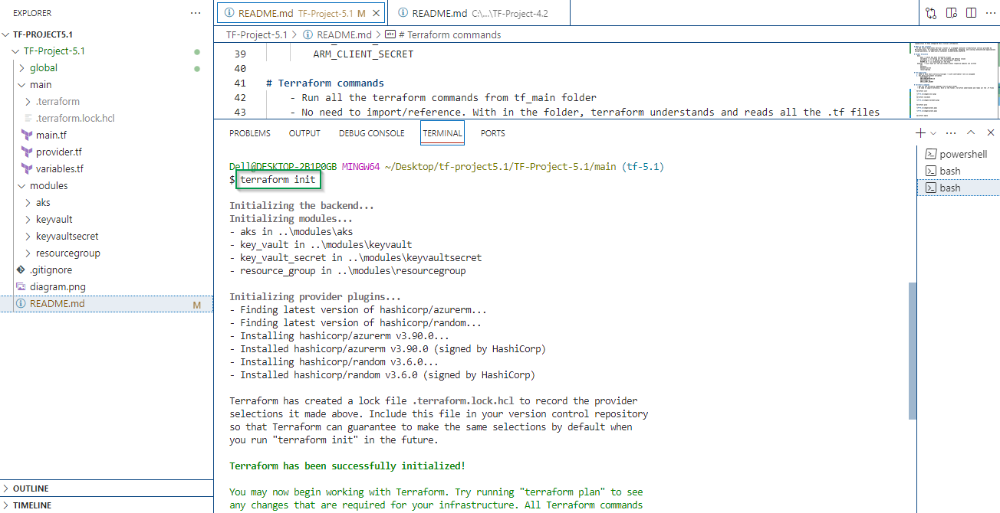
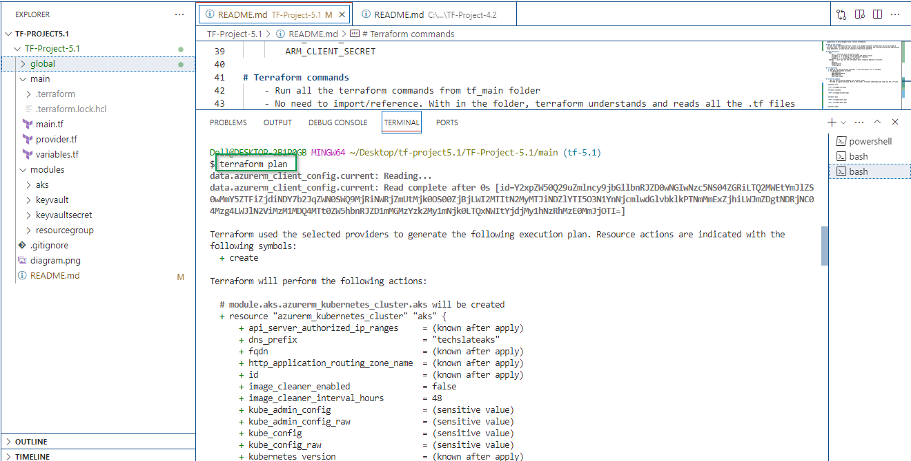
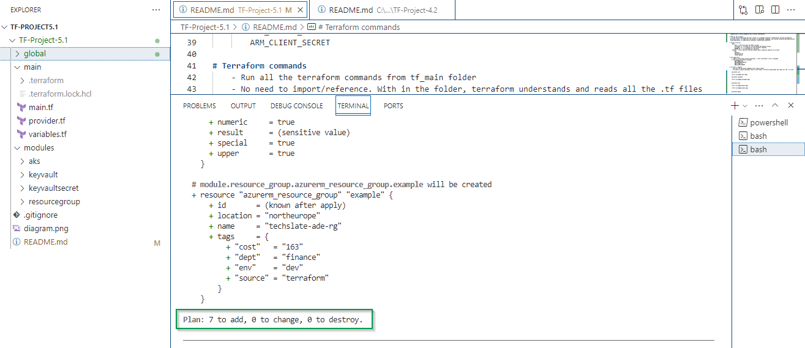
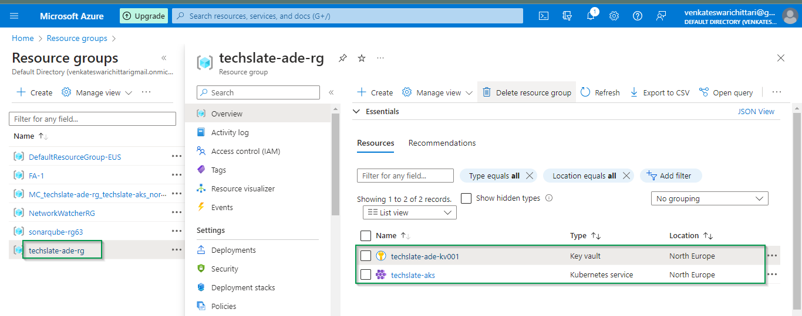
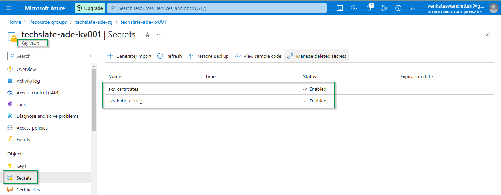

# Introduction 
 This is the terraform script to create Resource Group, Key Vault, KV Access Policy, Key Vault Secrets & AKS Cluster

# What is Resource Group?
 - A resource group is a logical container in Microsoft Azure that holds related resources for an Azure solution. It's a way to group Azure resources such as virtual machines, storage accounts, databases, and networking components together for organizational and management purposes.

# What is Key Vault? 
 - Key Vault is a cloud service provided by Microsoft Azure that enables you to securely store and manage sensitive information such as cryptographic keys, secrets (like passwords or API keys), certificates, and other types of credentials.

# What is Key Vault Access Policy?
 - A Key Vault (KV) Access Policy is a mechanism provided by Azure Key Vault for managing access to keys, secrets, and certificates stored within the vault. Access policies define who can perform specific actions (such as read, write, list, and delete) on resources stored in the Key Vault.

# What is Key Vault Secrets?
 - Key Vault Secrets refer to sensitive information, such as passwords, connection strings, API keys, and other types of credentials, that are securely stored and managed within Azure Key Vault. Key Vault provides a secure and centralized repository for storing secrets, offering various features and capabilities to help safeguard this critical information.

# What is aks cluster?
 - An AKS (Azure Kubernetes Service) cluster is a managed container orchestration service provided by Microsoft Azure. It simplifies the process of deploying, managing, and scaling containerized applications using Kubernetes, an open-source container orchestration platform.

# Folder Structure
 	main 
        main -> which has main terraform scripts
        variables -> is having all the variables and default values
        providers.tf -> is having all the providers required
        README.md -> is containing all the help
    modules  -> will have all the sub folders where respetive modules are written
        aks
        keyvault
        keyvaultsecret
        resourcegroup

# Pre-requisites
   1. Need to have Azure service principal -> with contributor role is assigned
   2. Set below envirnment variables
	    ARM_TENANT_ID
	    ARM_SUBSCRIPTION_ID
	    ARM_CLIENT_ID
	    ARM_CLIENT_SECRET

# Terraform commands
    - Run all the terraform commands from tf_main folder
    - No need to import/reference. With in the folder, terraform understands and reads all the .tf files
```
   terraform init
   ```
   
  ```
   terraform validate
   ```
   

  ```
   terraform plan
   ```
   

   

 ```
   terraform apply
   ```
   

   

### Now all the resources are created in Microsoft Azure portal.

   

   

   

